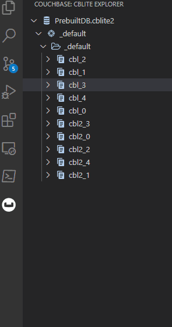
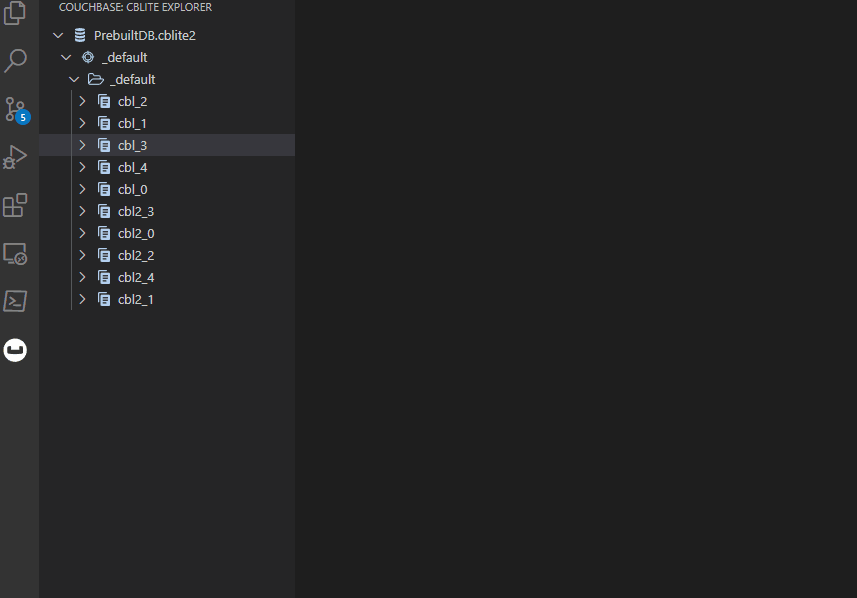
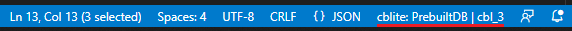
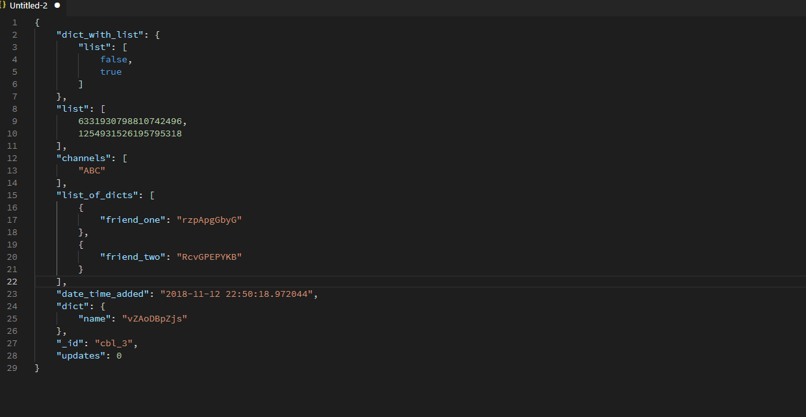
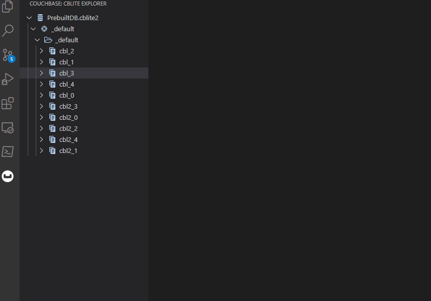

# Couchbase Lite for VSCode

This is a Visual Studio Code extension for interacting with a Couchbase Lite database. [Couchbase Lite](https://docs.couchbase.com/couchbase-lite/3.0/index.html) is full featured NoSQL JSON document database for mobile, desktop and embedded platforms. This extension includes support for enumerating documents and running ad-hoc queries.  This plugin is heavily inspired by the [SQLite extension](https://github.com/AlexCovizzi/vscode-sqlite/) that provides similar functionality.  Some icons used in the product were downloaded from [IconScout](https://iconscout.com/) via the free license.

## Quick Tour

### Open a Database

This can be accomplished in a few different ways. 
- The fastest way is to have Visual Studio Code open with a workspace that contains some `cblite2` databases inside.  Then you can right click and open as in the following:


- If you have opened a folder as described above you can also use the *Open Database* command from the [command pallete](https://code.visualstudio.com/docs/getstarted/userinterface#_command-palette), and any cblite2 databases discovered will be listed, with a final entry (*Choose database from file*) to open using a standard file open dialog.


:warning: Opening a database using this plugin will automatically upgrade it to 3.0 version of Couchbase Lite silently.  If this is undesirable, make a copy of the database folder before opening it with the plugin.

### Interact With Documents

Once you have opened a database, you can browse its contents in the *CBLite Explorer* pane that appears on the left hand side of Visual Studio Code:



If you want to retrieve the contents of a given document, you can right click it and choose *Get Document*



Now notice the status bar shows that you are currently working in the context of the document you opened:



You can now make changes and save back to the database by using the *Update Document* command:



### Querying

By default only [SQL++ (aka N1QL)](https://docs.couchbase.com/couchbase-lite/3.0/c/query-n1ql-mobile.html#query-format) commands are enabled, and so only those will be covered here.  Beware of dragons if you enable JSON queries.

To run a query, right click on an opened database and select *New SQL++ Query*.  That will open a new document editor in which you can run your query and get the results:



### Create Document

To create a document, create a file of type "json" and add the JSON document contents. Then select *Create New Document* from the command palette to add the document to the database.


## Building

- First, clone this repo

```bash 
git clone https://github.com/couchbaselabs/vscode-cblite

```

- Then, since this plugin relies on the Couchbase Lite for C API, [download](https://www.couchbase.com/downloads?family=couchbase-lite) Couchbase Lite C SDK and copy the contents from the root folder of the package into the *deps* folder as indicated in [deps/README.txt](deps/README.txt).

- Next, run `npm install` to install all the needed dependency node modules into the project folder.

- Lastly, webpack requires all references native shared libraries to exist and will fail to build without products present for all three supported platforms (Windows, macOS, Linux).  The current platform's library will get built when performing a build, but the remaining two will not.  If you are developing, it is enough to just shim them in as empty files (i.e. `touch` / `New-Item`).  The error message that happens when you build should be indicative, but the location the libraries are expected are `out/Windows/cblite-js.node`, `out/Darwin/cblite-js.node` and `out/Linux/cblite-js.node`.


### Debug, for local testing

- Opening the root directory of the project with Visual Studio Code and pressing `F5` will build and open the extension for debugging.

- However, if you want to build from the command line then running `npm run compile` will get you the final product, unpackaged.

- The notable parts are `dist/extension.js`, containing the final Javascript, and various flavors of `cblite-js-<Platform>.node` which are the result of the native compilation.  Also any of the downloaded cblite C shared libraries will also be present (i.e. cblite.dll, libcblite.dylib, etc) on Windows or macOS.

### Release, for packaging

- `npm run package` will perform similar steps but make a production build instead.

Note: if you've built a debug build you will need to erase the `build/` directory first.  

- The final product of this is `vscode-cblite-<version>.vsix` and can be installed into a Visual Studio Code instance either through the extension manager, or by running `code --install-extension <path/to/vsix>` on the command line.

### Use as node.js Binding

The [repo](https://github.com/couchbaselabs/vscode-cblite) can also be used as a standalone node.js binding for Couchbase Lite for C.  

For this, 

- Follow the normal process of building as described in "Building" section above. 

- The file `out/native/binding.js` can be imported into a node.js application. 

- You must also copy the cblite shared binary (i.e. libcblite.so.3 libcblite.dylib or cblite.dll) into `build/Release`(or `build/Debug`) folder (which will contain `cblite-js.node*`file).
